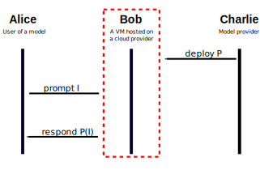

# Trusted Execution Environment (TEE) Basics

- [The model](#the-model)
  - [Establish trust](#establish-trust)
- [Further reading](#further-reading)

## The model
There are various possible scenarios: inference requests, training requests (which can involve just two parties), federated learning etc. (which may involve multiple parties interacting with each other). For illustration purposes, below is a simple inference scenario.

Alice wants to interact with Charlie's program, say, an AI model. Yet Charlie doesn't run his program himself. He deploys it instead to a third party, Bob, and lets him run the computations and respond to requests.

Unfortunately Bob is not entirely trustworthy. He is a virtual machine, hosted by a cloud provider. Hence, without special measures, Bob is only as trustworthy as the cloud machine he's running inside. If the cloud provider is compromised, or malicious, they may attempt to either:
1. Snoop on the messages transmitted to Bob, which may compromise the **privacy** of the interaction
2. Modify Bob's state, which may compromise the **integrity** of the interaction

How can Alice and Charlie establish trust in Bob, even as he is hosted by an untrusted party?

### Establish trust

The first step is to ensure the remote VM is running inside a TEE. This is done by looking at its attestation report and checking that its signing key (AK) is trusted by a trusted authority (usually an Intel / AMD root certificate).

This guarantees **privacy in use**: all data processed on the remote VM by its vCPU is hidden from the cloud provider's hypervisor. So the remote VM can be trusted to process sensitive data.

This is done by attesting the remote VM is running inside a TEE: checking its attestation report, ensuring Secure Boot happened correctly & the OS is in a sane state.

There are two other layers of privacy that need to be taken care of:
* **privacy in transit**: data that is sent to the VM over the network must be encrypted. See the [RA-TLS protocol](https://arxiv.org/vc/arxiv/papers/1801/1801.05863v1.pdf);
* **privacy at rest**: data stored on the drives of the VM must be encrypted, and the keys must not be visible to the cloud provider.

I have not delved deeply into these other two privacy mechanisms.

Does this suffice to establish trust? No: even if data on the VM is hidden from snooping eyes, it's not hidden from the VM itself. So the software running on the VM needs to be trustworthy. That means, in the first place, ensuring integrity of the operating system loaded by the bootloader.

This is done by secure boot and measured boot. Further, userland software may be doing its own runtime measurements, in order to also fingerprint the state of the VM *after* the operating system booted up.

## Further reading
In no particular order, here's a list of references. Please add stuff to this list if you find any further good resources.

1. [RFC 9334](https://www.rfc-editor.org/rfc/rfc9334): Remote ATtestation procedureS (RATS) Architecture
2. [White papers & reports](https://confidentialcomputing.io/resources/white-papers-reports/) of the Confidential Computing Consortium
3. [Survey of research on confidential computing](https://ietresearch.onlinelibrary.wiley.com/doi/full/10.1049/cmu2.12759) (open access paper)
4. [NEAR AI](https://near.ai/), [Automata](https://www.ata.network/), who also seem to specialize in bringing TEEs to Web3
5. [This repository](https://github.com/salrashid123/tpm2/tree/master) which has many code snippets of interacting with the TPM chip for different tasks (attestation, verification, sealing etc.)
6. Interest in TEEs is far from being reserved only to AI / Web3. As a matter of fact, you probably have a TEE running in your pocket already :smile: Check out the Android docs:
   - https://source.android.com/docs/security/features/trusty
   - https://source.android.com/docs/core/architecture/bootloader
